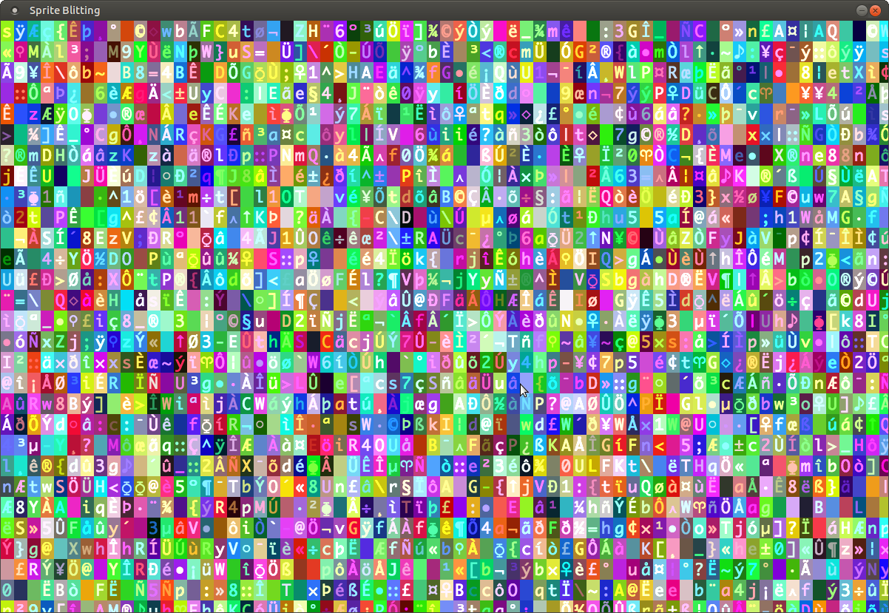

# Sprite Blitting for Rust using SDL2

A simple program that shows how to blit sprites from a
spritesheet to the screen using the crate [rust-sdl2](https://github.com/Rust-SDL2/rust-sdl2).

* Loading a spritesheet
* Setting the transparent color on a spritesheet
* Blitting a portion of a spritesheet to a separate buffer (double buffering)
* Tinting the sprite a certain color
* Clamping the framerate to once per second

